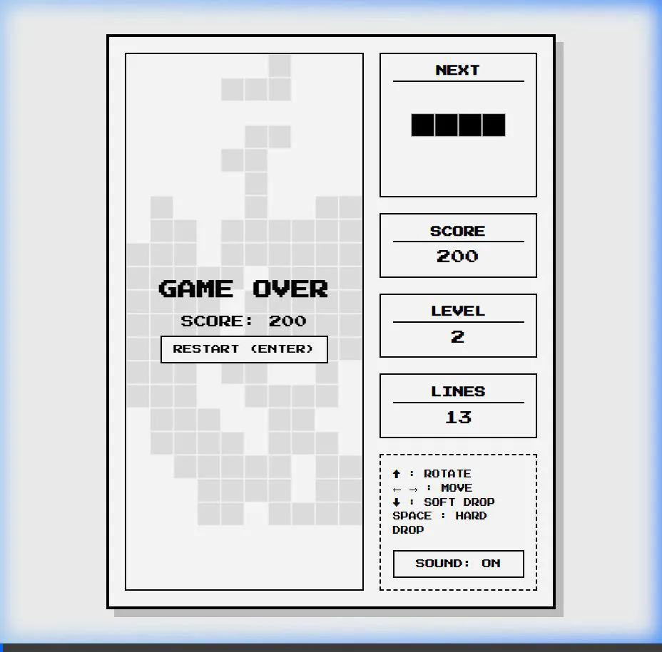

# 黑白俄羅斯方塊開發總結

專案已經成功開發完成！以下是本次實作的重點成果：

## 實作內容

我們從零開始建立了一個純粹依賴網頁前端技術（HTML/CSS/JS）的俄羅斯方塊遊戲。

### 1. 介面與風格 (純黑白)
- 實作了極簡的黑白風格（淺灰色背景、黑色線條與黑色方塊），確保視覺對比強烈且不刺眼。
- 包含了左側主遊戲區與右側的資訊面板（顯示預覽方塊、分數、等級與操作說明）。
- 提供開始畫面與遊戲結束畫面覆蓋層。

### 2. 遊戲核心邏輯
- **方塊系統**：實作了 7 種經典的 Tetromino 方塊形狀。
- **物理與碰撞**：使用二維陣列進行盤面資料管理，並實作精確的邊界與方塊碰撞偵測。
- **控制系統**：
  - `←` / `→`：左右移動方塊。
  - `↑`：旋轉方塊（並處理了靠牆旋轉的防穿牆邏輯）。
  - `↓`：軟下落（加速落下）。
  - `Space` (空白鍵)：硬下落（瞬間落地並固定），符合大部分玩家的習慣。
- **遊戲迴圈與計分**：使用 `requestAnimationFrame` 確保流暢的更新，並實作了消除行後的計分與等級提升（速度加快）機制。
- **邊緣旋轉修正**：修正了非正方形矩陣導致旋轉變形的問題，透過填滿 $N \times N$ 矩陣確保旋轉邏輯的準確度。

### 3. 音效合成
- **無外部檔案依賴**：為符合「純 HTML」的需求，我們未使用任何 `.mp3` 或 `.wav` 檔案。
- **Web Audio API**：透過 JavaScript 內建的音訊合成器（OscillatorNode）產生 8-bit 風格的方波音效，包含了：移動、旋轉、下落、消除與遊戲結束五種不同音效。

## 遊戲展示影片

## 如何測試
請直接在您的電腦上開啟 [index.html](./index.html)，即可在瀏覽器中開始遊玩！

> [!TIP]
> 點擊開始畫面上的 **START** 按鈕或是直接按下 **Enter** 鍵即可開始遊戲。建議開啟電腦音量以體驗復古的合成音效。
